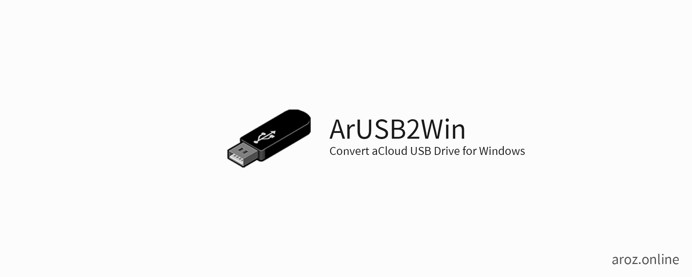
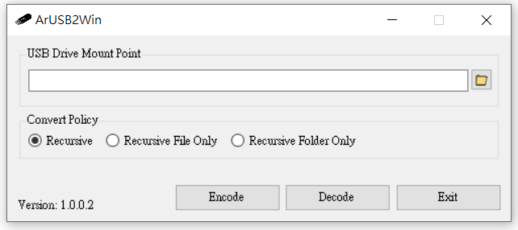

# ArUSB2Win

ArOZ USB Drive Filename to Windows Filename Converter - 
This is a simple tool for users to convert all the UM-filename files use in ArOZ File System into normal Windows readable file naming method.

To use it, simply download the exe file, select the USB drive mount point (e.g. F:\ or G:\ ) or any sub-directory and press "Decode". 
This will decode all the filename and folder recursively into readable filenames on Windows.

If you want to mount the USB drive back into the ArOZ Online System, simply select your USB drive mount point again and press "Encode".
You will see all filename are being read correctly after the USB is plugged back into your ArOZ Host Device.

## Download
See [release list](https://github.com/tobychui/ArUSB2Win/releases) for the latest build.
## Preview

## Contributing
Contributions are what make the open source community such an amazing place to be learn, inspire, and create. Any contributions you make are greatly appreciated.

1. Fork the Project
2. Create a branch named "experimental-{yourname}" and add anything you want
3. Push to the Branch
4. Open a Pull Request

## License
Distributed under the MIT License. See LICENSE for more information.
**The fsconv is not part of the project. However, we got permission to open source our tool with the fsconv binary included**

## Contact
You can find me over [here](https://www.facebook.com/ImusLaboratory/) if you need any help regarding the use of this application.
